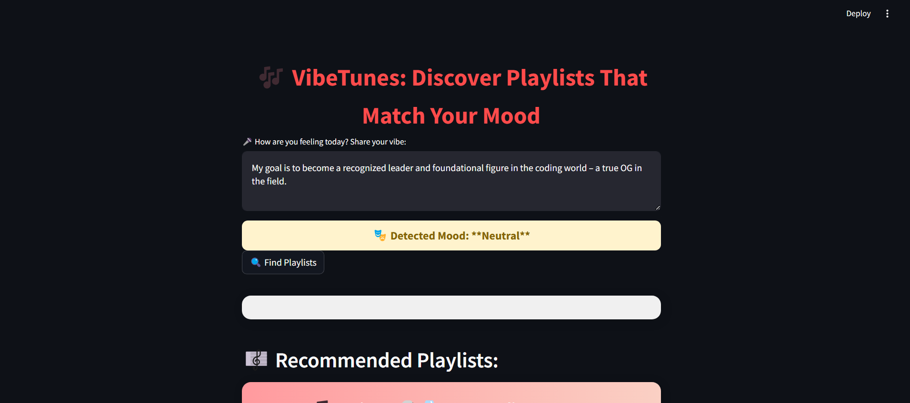
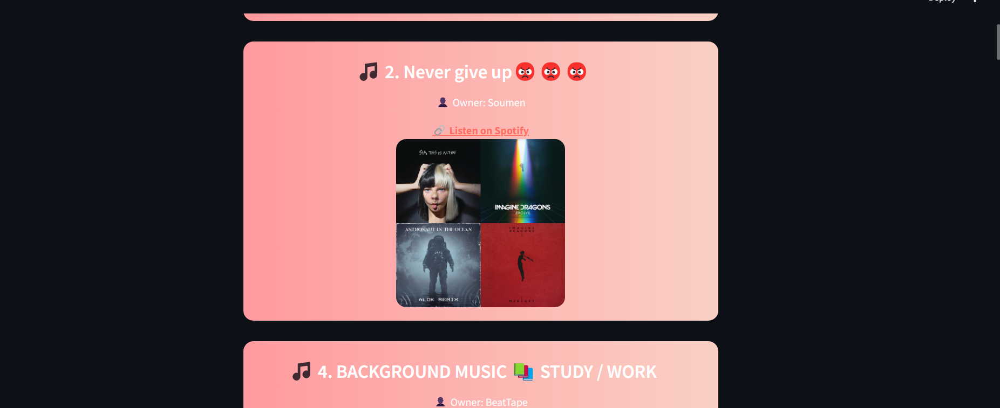

# VibeTunes: Your Mood-Based Spotify Playlist Finder 🎶


_Add your application's logo here._

## Overview

VibeTunes is a web application that leverages sentiment analysis to discover Spotify playlists perfectly tailored to your current mood.  Simply tell VibeTunes how you're feeling, and it will analyze your input, detect the sentiment (positive, negative, or neutral), and then search Spotify for playlists that match that vibe.  It uses advanced machine learning techniques and the Spotify API to provide a seamless and personalized music discovery experience.

## Key Features

*   **Sentiment Analysis:** Accurately determines the emotional tone of your input using a fine-tuned transformer-based sentiment analysis model.
*   **Intelligent Spotify Search:**  Adapts Spotify search queries based on the detected sentiment to find the most relevant playlists.
*   **User-Friendly Interface:**  An intuitive and easy-to-use web interface powered by Streamlit makes finding the perfect playlist a breeze.
*   **Dynamic Playlist Recommendations:**  Fetches and displays Spotify playlist details, including name, owner, and a link to listen directly on Spotify.
*   **Responsive Design:**  Works seamlessly on desktops and mobile devices.

## Screenshots

<!--
Include Screenshots of app here 
1. Homescreen (text, buttion, feedback)
2. Playing Songs -->
  _Screenshot 1: VibeTunes Homepage - Input your mood and trigger a search!_
  
 _Screenshot 2: Recommendations based on music!_
   

_More screenshots coming here..._

## Technologies Used

*   **Backend:**
    *   **FastAPI:**  A modern, fast (high-performance), web framework for building APIs with Python 3.7+ based on standard Python type hints.  Handles API endpoints for sentiment analysis and Spotify search.
    *   **Transformers Library (Hugging Face):**  Provides pre-trained models and tools for natural language processing, including sentiment analysis. Specifically, `cardiffnlp/twitter-roberta-base-sentiment` is used.
    *   **PyTorch:** Open source machine learning framework used for sentiment analyiss model development.
    *   **Spotify API:**  Used to search for playlists on Spotify based on keywords and to retrieve playlist information (name, owner, links, images).
    *   **dotenv:** Used to manage secret keys.
*   **Frontend:**
    *   **Streamlit:**  An open-source Python library that makes it easy to create and share beautiful, custom web apps for machine learning and data science.
*   **Environment Management:**
    *   **venv:** Used for isolated development of the python-project

## Setup and Installation

Follow these steps to set up VibeTunes on your local machine:

### Prerequisites

*   **Python 3.8+:**  Make sure you have Python 3.8 or a later version installed. You can download it from [python.org](https://www.python.org/downloads/).
*   **pip:**  Python package installer (should be included with your Python installation).
*   **Spotify API Credentials:** You will need to obtain your Spotify API credentials. Follow these steps:
    1.  Go to the [Spotify Developer Dashboard](https://developer.spotify.com/dashboard/).
    2.  Create an account or log in.
    3.  Create a new app.  Give it a name and description.
    4.  Note the **Client ID** and **Client Secret**.
    5.  Add `http://localhost:8000` in **Redirect URIs**

### Installation Steps

1.  **Clone the Repository:**
    ```bash
    git clone <your-repo-url>
    cd VibeTunes
    ```

2.  **Create a Virtual Environment (Recommended):**

    ```bash
    python3 -m venv venv
    source venv/bin/activate  # On Linux/macOS
    venv\Scripts\activate  # On Windows
    ```

3.  **Install Dependencies:**

    ```bash
    pip install -r requirements.txt
    ```

4.  **Configure Environment Variables:**

    *   Create a `.env` file in the root directory of the project.

    *   Add your Spotify API credentials to the `.env` file:

        ```
        SPOTIFY_CLIENT_ID=<your_client_id>
        SPOTIFY_CLIENT_SECRET=<your_client_secret>
        ```
    *   **IMPORTANT:**  Do not commit your `.env` file to a public repository. Add it to your `.gitignore` file.

5.  **Download Trained Model:**

     * You need a trained sentiment analysis model in a directory called `models` one level up from main directory
     * Create your `models` folder in that directory.
     * Ensure `MODEL_DIR = os.path.join(os.path.dirname(os.path.abspath(__file__)), "../models")` and `USE_HUGGINGFACE_DATASET = False` in `main.py`
     * Either train or download a pre-trained and place that in the file structure
     * Follow `training/train_sentiments.py` file in this Repo to training the model. 
     * Training on your own means modifying lines in `main.py` to link this correctly.

     ```
     └── VibeTunes/
         ├── data/
         ├── models/
         │   └── sentiment.pt #Your weights file should be in there.
         ├── backend/main.py
         ├── training/train.py
         ├── .env
         ├── .gitignore
         ├── frontend/api.py
         ├── README.md
         └── requirements.txt
     ```

6.  **Run the FastAPI Backend:**

    ```bash
    uvicorn main:app --reload
    ```
    * --reload means changes in `main.py` reflect onto the uvicorn as well.
    * The backend server will start at `http://localhost:8000`.

7.  **Run the Streamlit Frontend:**

    Open a new terminal window and activate the virtual environment:

    ```bash
    source venv/bin/activate  # On Linux/macOS
    venv\Scripts\activate  # On Windows
    ```

    Run the Streamlit app:

    ```bash
    streamlit run api.py
    ```

    The Streamlit app will open in your web browser (usually at `http://localhost:8501`).

## Usage

1.  Open the VibeTunes web application in your browser.
2.  Enter a description of how you're feeling in the text area.  Be as descriptive or concise as you like!
3.  Click the "Find Playlists" button.
4.  VibeTunes will analyze your input and display a list of Spotify playlists that match your mood.
5.  Click on the "Listen on Spotify" link to open the playlist in the Spotify app.

## Troubleshooting

*   **Spotify API Errors:** Double-check your Client ID and Client Secret in the `.env` file. Make sure you have also included a **Redirect URIs** in the dashboard.

*   **Dependency Issues:**  Ensure all dependencies are installed correctly by running `pip install -r requirements.txt`.

*   **Backend Not Running:**  Make sure the FastAPI backend server is running before you start the Streamlit frontend. Check `uvicorn main:app --reload` has spunned up successfully and in the background.

*   **Model Load Errors:** Verify that the sentiment analysis model file exists in the correct directory (`./models/`) and is accessible. Also set correctly in `main.py`
## Contributions

Contributions to VibeTunes are welcome!  Feel free to fork the repository, make changes, and submit a pull request.